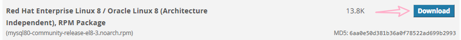
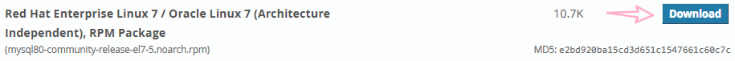
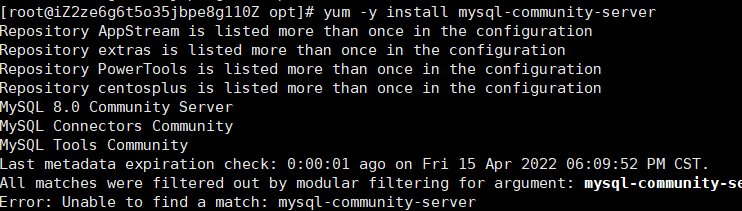
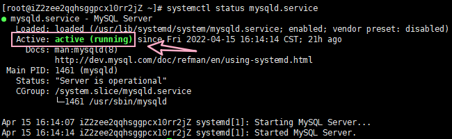
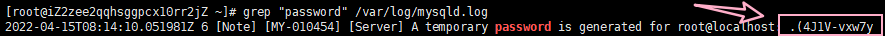
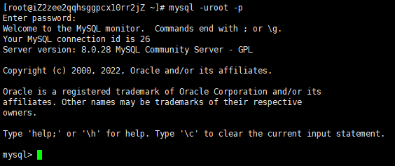
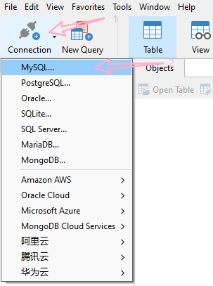
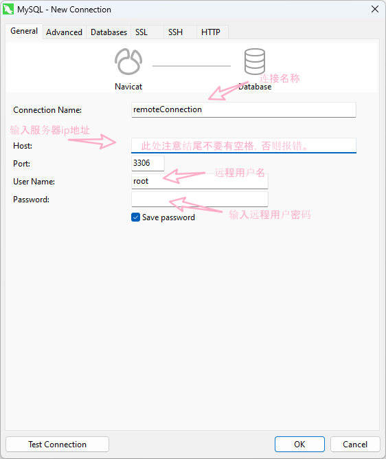
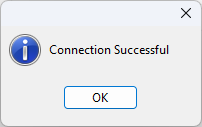

# MYSQL8.0 - CentOS

------

## 下载并安装 `MYSQL` 官方的 `Yum Repository` 

### 下载

此地址下载`rpm package` [Yum Repository](https://dev.mysql.com/downloads/repo/yum/)

#### CentOS 8

如果使用CentOS8版本，则下载下图 `rpm package`

或通过 `wget` 命令直接在Linux中下载，如下命令

`wget http://dev.mysql.com/get/mysql80-community-release-el8-3.noarch.rpm` 

#### CentOS 7

如果使用CentOS7版本，则下载下图 `rpm package`

或通过 `wget` 命令直接在Linux中下载，如下命令

`wget http://dev.mysql.com/get/mysql80-community-release-el7-5.noarch.rpm` 

------

之后通过`xftp` 或其他工具将 `rpm package` 放入Linux 的 `/opt` 目录（Suggestion）

### 安装 `rpm package`

通过以下命令，安装上文下载的 `rpm package` 

#### CentOS 8

`yum localinstall mysql80-community-release-el8-3.noarch.rpm ` 

#### CentOS 7

`yum localinstall mysql80-community-release-el7-5.noarch.rpm ` 

------

### 安装 `mysql-community-server` 

`yum -y install mysql-community-server` 

>   如果使用 CentOS 8 版本，则有可能遇到如下问题
>
>   
>
>   `ERROR: Unable to find a match: mysql-community-server` 
>
>   ------
>
>   ==解决方案==：
>
>   输入以下命令
>
>   `yum module disable mysql` 禁用本地mysql模组
>
>   之后再执行安装 `mysql-community-server` 

## `MYSQL` 数据库设置

### 启动 `MYSQLD` 服务

`systemctl start mysqld.service` 

### 查看 `MYSQLD` 服务运行状态

`systemctl status mysqld.service` 

如果出现下图 `Active: active(running)` 则代表服务启动成功

### 查找默认 `ROOT` 密码

如果想要进入 `mysql` 则需要找到默认的 `root password` ，通过以下命令查找：

`grep "password" /var/log/mysqld.log`

所选区域即为 `default root password` 通过该密码进入 `mysql` 

### 进入数据库

`mysql -u root -p` 

在回车之后会提示输入密码，但是输入并不会有提示。直接输入查找到的默认 ROOT 密码即可。

下图状态，即为**成功进入数据库**：

### 修改密码

`ALTER USER 'root'@'localhost' IDENTIFIED BY 'Fahaxiki&7';` 

>   ==默认密码策略要求密码必须是大小写字母数字特殊符号的组合，至少8位== 

### 设置允许远程登录

`use mysql;`

`GRANT ALL ON *.* TO 'root'@'%';` 

>   在此可能会遇到如下问题：
>
>   `ERROR 1410 (42000): You are not allowed to create a ures with GRANT`
>
>   
>
>   ==解决方案1== :
>
>   查询`user table`中的 `user` 和 `host` 
>
>   `select user,host from user;`
>
>   可以发现`user`  为 `root` 的 `host` 为 `localhost` 只允许本地登录
>
>   执行以下命令修改权限：
>
>   `update user set host='%' where user='root';` 
>
>   再执行两遍以下命令：
>
>   `GRANT ALL ON *.* TO 'root'@'%';` 
>
>   >   若 `navicat` 远程连接数据库出错1251
>   >
>   >   则需要修改加密方式：
>   >
>   >   `alter user root identified with mysql_native_password by 'Fahaxiki&7';`
>
>   ==解决方案2== ：<u>本质和解决方案1是相同的，只是新建了一个远程用户</u> 
>
>   创建用户 `create user 'remoteuser'@'%' identified by 'Fahaxiki&7';` 
>
>   分配权限 `grant all privileges on *.* to 'remoteuser'@'%';` 
>
>   遇到 `ERROR 1410(42000)` 则按照解决方案1执行，只需要将 `root` 替换为 `remoteuser` 即可。

***最后不要忘记刷新权限：***

`flush privileges;` 

## `navicat` 连接远程数据库

新建 `mysql` 连接

**测试连接**，**连接成功**。

